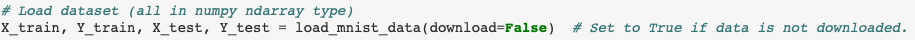
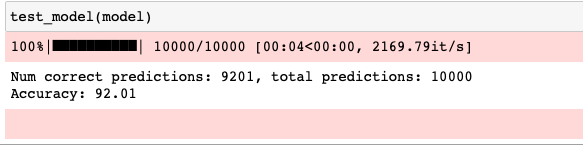

# Naive-MNIST
This is a _**NAIVE**_ implementation of training digit recognition with MNIST Database

## Quick-start
- Change `download` parameter to _True_ to download the dataset.

## Resources
- MNIST Database: [Click Here](http://yann.lecun.com/exdb/mnist/)

## Examples

